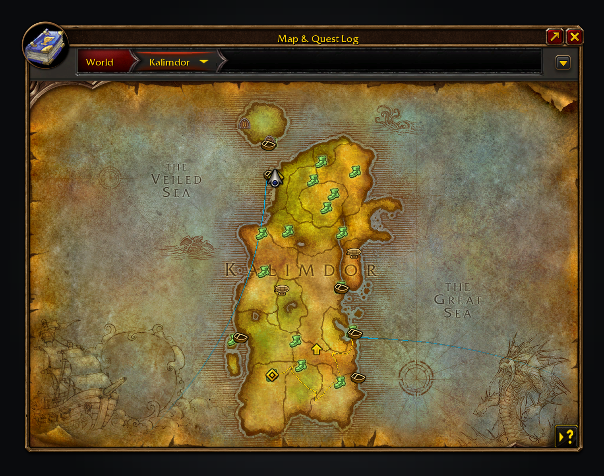

<p align="center"></p>

<h1 align="center">Shortest Path Forever</h1>

<p align="center">
The fastest way anywhere in WoW: Forever, on foot, by air, by sea and through portals.<br>
<a href="https://github.com/cjber/shortest-path-forever/actions/workflows/ci.yml"></a>
<a href="https://github.com/cjber/shortest-path-forever/releases/latest"></a>
</p>

Shift-click the world map or minimap, or pick a quest, and it plans the route: walking paths round walls and hills,
the flight points you know, boats and zeppelins with their live departure times, lifts, the tram and portals. Then it
walks you there with the game's own navigation marker. Walking maps cover Eastern Kingdoms, Kalimdor and Zephras Isle;
they come in the same download and load only when a route needs them.
The route, pins and tracker use the game's own art, so it looks like it came with the game.


## Features

Each feature has more detail in [docs/features.md](docs/features.md).

- **Journey planner.** Shift-click the map or minimap, or choose *Plan journey* on a quest, for the fastest way there:
  walking through tunnels and city levels, known flight points, boats, zeppelins, lifts, the tram and portals. The
  route is drawn on both maps and its steps sit in the objective tracker. It replans as you move, switching only for a
  clearly faster way.
  
- **Guide.** The game's own waypoint marker leads you along the route turn by turn, round walls rather than straight at
  the stop, and hands your tracked quest back when you arrive. Click the tracker header to turn it off.
  
- **Optional compass.** A slim strip at the top of the screen marks Guide's next two turns, the next stop and your
  destination. Turn it on in `/path`.
  
- **Docks on the world map.** Piers and zeppelin towers get the stock ferry icon and a matching zeppelin. Hover one for
  where each boat goes next and when; the docks it sails to light up and its routes are drawn. Click one to open the
  map at the other end, where a ping marks the dock; one with several destinations asks which.
  
- **Lifts, the Deeprun Tram and portals** count down like the boats; portals are marked with where they go, and
  clicking a station or portal opens the map where it comes out. Docks, lifts, stations and portals show on the
  minimap too, with the same tooltips; *Transport* in the minimap's tracking menu turns them off there.
- **Next departures.** At a dock, lift or tram station, a tracker section above your quests counts down to every
  arrival and departure; on board, it shows the next call.
- **Arrival alerts.** A raid-warning banner, the ship's own bell (the horn for a zeppelin, the tram pulling in
  for the tram) and a flashing taskbar icon half a minute before your boat arrives, for anyone waiting AFK.
- **Times from real rides, shared.** One ride, yours or another player's, times a boat for hours. Sightings pass
  quietly over guild, party and yell at the docks; turn sharing off in the settings.



## Install

Install it from [CurseForge](https://www.curseforge.com/wow/addons/shortest-path-forever) or
[Wago Addons](https://addons.wago.io/addons/shortest-path-forever), or download the zip from
[Releases](https://github.com/cjber/shortest-path-forever/releases). To install the zip by hand, extract it into
`_classic_beta_/Interface/AddOns/` so you end up with `AddOns/ShortestPathForever/ShortestPathForever.toc`.

## Usage

| Command | What it does |
|---|---|
| `/path` | Open the settings (also in Settings → AddOns, or from the addon compartment on the minimap) |
| `/path perf` | Print this addon's CPU averages and peaks from the client's profiler, and its memory after a full collection |
| `/path debug` | Keep a trace of your position and ride matching, for reporting a ride that did not sync |

Every feature has its own switch in the settings. Searches and tracker updates wait until combat ends.

## How the times work

Routes, docks and each boat's timetable are generated by `tools/gen_routes.py` from the client's
`TaxiPathNode` table: the transport paths with stops, timed with the server's transport model (CMaNGOS
`TransportMgr`). The eight classic routes match their sniffed loop times to within 0.07%, and those eight routes
are stretched onto their measured periods; the rest use the mean correction. What the data cannot know is
where in its loop a boat is right now; that is what a ride (yours or another player's) supplies.

Lifts and the tram come from the client's `TransportAnimation` table placed at their CMaNGOS spawns, flight
paths from `TaxiNodes`/`TaxiPath` (with InFlight's recorded flight times where it has them), and portals
from CMaNGOS's teleport triggers; `tools/gen_transit.py` builds all three. The planner uses discovered flight
points, and may walk to an undiscovered flight master when learning it makes the journey faster.

## Works alongside

Addons can use `ShortestPathForever.API` (`version = 1`) with uiMapIDs and normalized 0–1 coordinates.
`Estimate(fromMap, fromX, fromY, toMap, toX, toY)` returns travel seconds or `nil` without changing guidance;
it omits endpoint terrain searches and caches estimates for five seconds, rounding origins to 0.0001.
`NavigateRoute(owner, stops)` guides through 1–64 `{map, x, y, title}` stops in order, advancing on arrival
and ending after the last. Remaining stops have numbered map pins and dotted previews; the tracker and
arrow show “Stop 2 of 4: …”. `Navigate(owner, map, x, y, title)` is the one-stop form. Both return a boolean;
invalid input, combat or disabled Journeys return `false` without replacing guidance. Titles are optional.
`CurrentStop(owner)` returns the current 1-based stop or `nil`; `Cancel(owner)` returns `true` only when it
clears that owner's whole route. Use your addon's name as `owner`; starting another journey replaces ownership.
Estimates return `nil` during combat.

## Development

```sh
tools/typecheck.sh                  # strict LuaLS + multi-value lint (requires LuaLS 3.19.1, git, Python 3)
python3 tools/gen_routes.py          # regenerate Data/Routes.lua for the pinned build
python3 tools/gen_transit.py         # regenerate Data/Transports.lua, Data/Taxi.lua and Data/Portals.lua
tools/draw_zeppelin.py               # redraw media/zeppelin.tga (the game has no zeppelin map icon)
(for s in tests/*_spec.lua; do luajit "$s" || exit 1; done)  # the headless specs
luajit -joff tests/journey_bench.lua  # searches, rounds and frames at the 3 ms budget
luajit tests/walk_sim.lua            # follow four real routes; assert zero route flips
```

CI runs luacheck, the specs, LuaLS, StyLua, ruff, shellcheck, shfmt, actionlint, zizmor, gitleaks and sift on pull
requests and pushes to main. The benches and their budgets are in [tests/journey_performance.md](tests/journey_performance.md)
and [tests/search_performance.md](tests/search_performance.md); [type-checking notes](types/README.md) cover the
pinned WoW API annotations, local declarations and intentional multi-value calls.

**Contributing:** [CONTRIBUTING.md](https://github.com/cjber/.github/blob/main/CONTRIBUTING.md), this repository's
[AGENTS.md](AGENTS.md), and [SECURITY.md](https://github.com/cjber/.github/blob/main/SECURITY.md) for private
security reports.

**Releasing:** move the `[Unreleased]` notes in `CHANGELOG.md` under `## [X.Y.Z] - YYYY-MM-DD`, then
`git tag -s vX.Y.Z && git push --tags`. The [BigWigs packager](https://github.com/BigWigsMods/packager) builds the zip
and uploads it to GitHub Releases, CurseForge and Wago.

## Licence

GPL-3.0-or-later. Routes, lifts, the tram and flight paths come from the game's data via
[wago.tools](https://wago.tools); transport timing and portals from [CMaNGOS](https://github.com/cmangos); recorded
flight times from [InFlight](https://github.com/LudiusMaximus/InFlight) (MIT).

Made by Cillian Berragan · [cillian.dev](https://cillian.dev) · [GitHub](https://github.com/cjber) · [Twitter](https://twitter.com/cjberragan)
