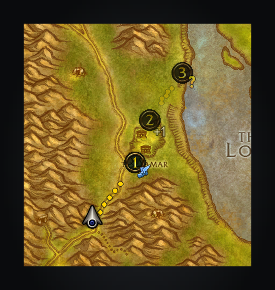

# Addon API

Addons can use `ShortestPathForever.API` (`version = 1`) with uiMapIDs and normalized 0–1 coordinates.
`Estimate(fromMap, fromX, fromY, toMap, toX, toY)` returns travel seconds, or `nil` and why (`"combat"`,
`"invalid"` or `"unreachable"`), without changing guidance; it omits endpoint terrain searches and caches
estimates for five seconds, rounding origins to 0.0001. An estimate from where the player stands counts their
hearthstone and class teleports, with cooldowns, unless the setting *Use your hearthstone and teleports* is off;
from anywhere else it leaves them out. `EstimateDetail` takes the same arguments and cache and returns
`{seconds, legs}`, each leg a fresh `{mode, to, seconds, wait?, newFlightPath?}`.
`NavigateRoute(owner, stops)` guides through 1–64 `{map, x, y, title}` stops in order, advancing on arrival
and ending after the last. Remaining stops have numbered map pins, and the way between them is drawn as
planned, walks along the walking map, once worked out behind the current leg; the tracker and arrow show
“Stop 2 of 4: …”. `Navigate(owner, map, x, y, title, kind)` is the one-stop form. Both return a boolean;
invalid input, combat or disabled Journeys return `false` without replacing guidance. Titles are optional.
A stop's optional `kind` says what stands there: `"pickup"`, `"turnin"`, `"objective"`, `"trainer"`,
`"innkeeper"`, `"flightmaster"`, `"battlemaster"`, `"dungeon"`, `"boat"`, `"zeppelin"`, `"lift"`, `"tram"` or
`"portal"`. Its numbered map pin then wears the game's own mark for it (a quest's “!” or “?”, a flight master, a
boat) as a small badge on its lower right; a lone stop shows the mark alone. The minimap circles the spot
rather than covering the game's icon there. Any other kind is ignored, as is a kind whose art the client lacks: the
stop keeps the plain pin.

`CurrentStop(owner)` returns the current 1-based stop or `nil`; `Cancel(owner)` returns `true` only when it
clears that owner's whole route. Use your addon's name as `owner`; starting another journey replaces ownership.
`Active()` says whether any journey is guiding, yours or another addon's. `Ended(owner)` says why that owner's
last journey ended: `"arrived"` after its last stop, `"cleared"` by the player (or by turning Journeys off),
`"replaced"` by another addon's or the player's journey, or `"cancelled"` by the owner's own `Cancel`; its second
return is the `GetTime()` it ended. It is `nil` while the journey runs, before the owner's first, and after a
reload. Poll it: Shortest Path fires no event of its own when a journey ends.
