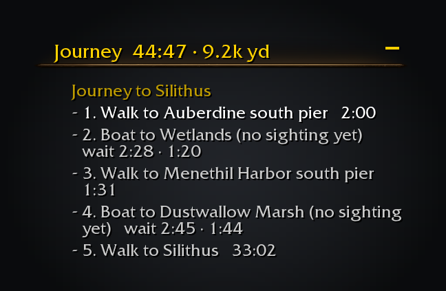
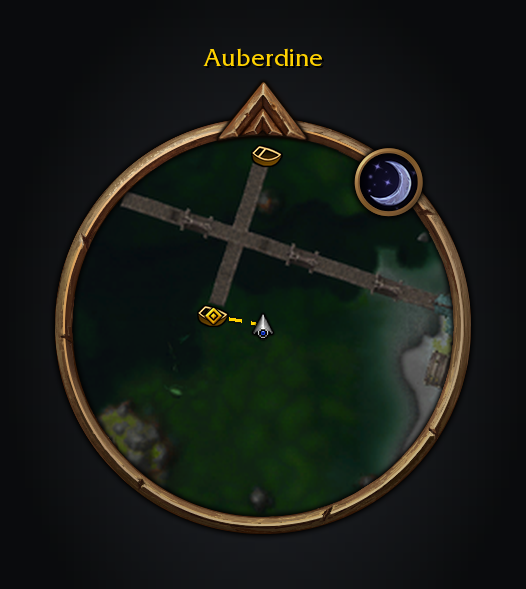
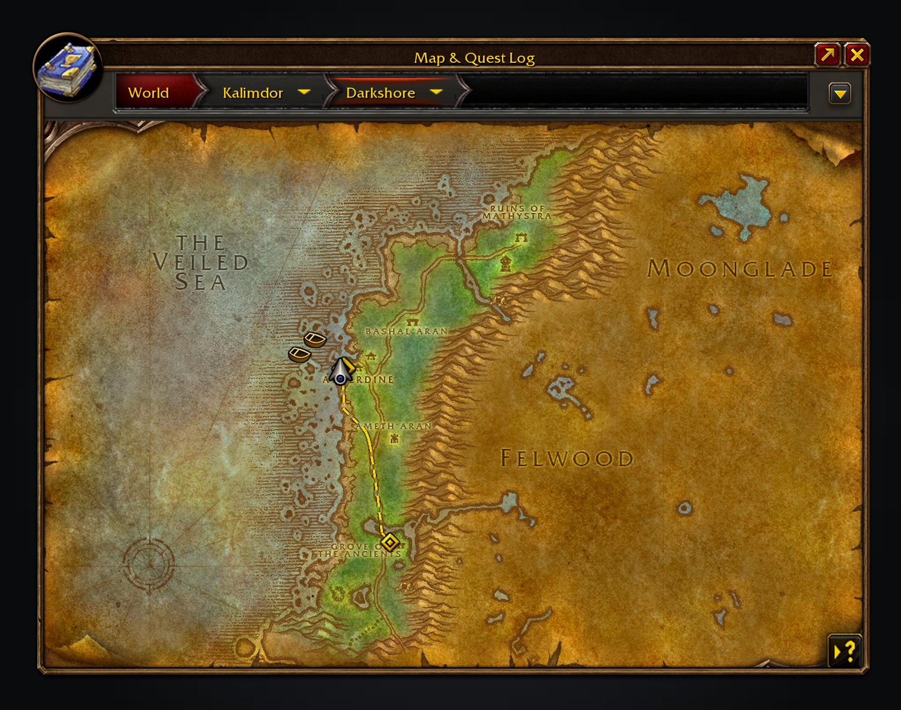
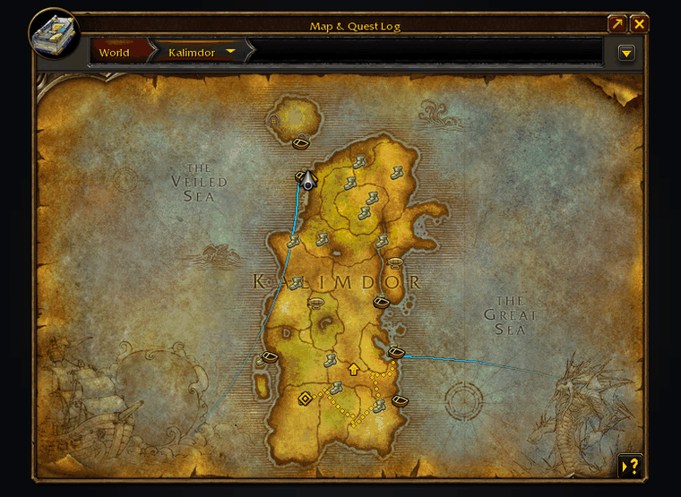
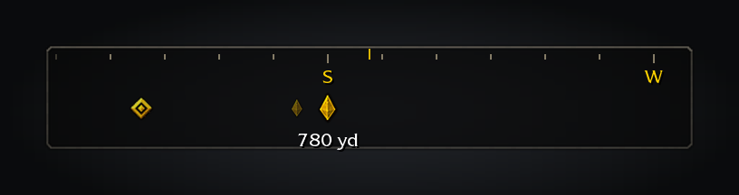
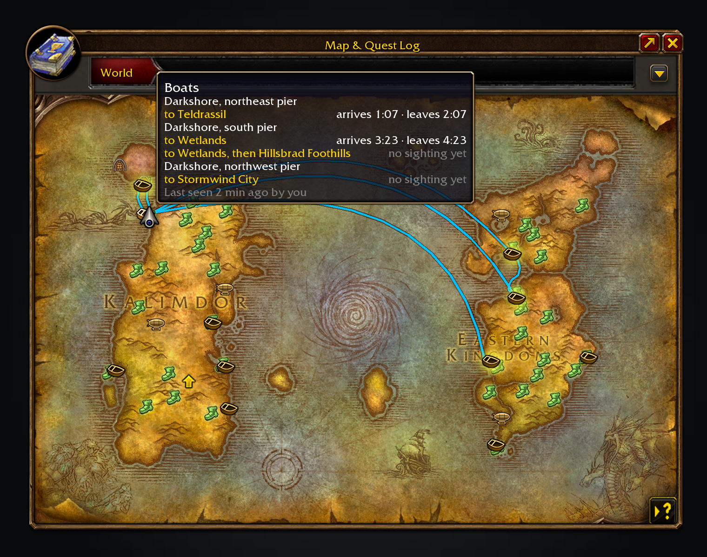

# Features in depth

The detail behind each feature in the [README](../README.md).

- **Journey planner.** Shift-click anywhere on the world map or minimap for the fastest way there from where you
  stand: walking, the flight points you know, boats and zeppelins with their live waits, lifts, the tram and
  portals, including a flight master you haven't found yet if walking to it pays off. Walks go through
  tunnels and between a city's levels, such as Dun Algaz and the Undercity, and walks keep out of water, which is slow and risky, unless you have Water Walking or Levitate (the step asks you to cast it). The route is drawn
  on the map and minimap, walking legs dotted, and the steps sit in the objective tracker like a tracked
  quest. It replans as you move but only switches to a clearly faster way (at least 30 seconds and a tenth of the time left), and stays aboard if you are already riding. **Guide**, on from the start
  of every journey (click the tracker header to turn it off), moves the game's own waypoint marker along the route turn by turn, so it leads you round walls
  rather than straight at the stop (or, with *Guide marks only where each step ends* in `/path`, straight at the next boat, lift or flight master), and hands your tracked quest back when you finish. To head for a quest, pick **Plan journey** from its right-click menu in the objective
  tracker or quest log, or Shift-click its marker on the map; a finished quest routes to its turn-in.
  A journey can start with your Hearthstone, a mage's city teleport (with a Rune of Teleportation), a shaman's
  Astral Recall or a druid's Teleport: Moonglade, after its own icon and named in your game's language:
  *1. Use Hearthstone*. A cooldown counts as waiting, and a jump to another continent adds a few seconds for
  the loading screen. The client does not say where your bind point is, so it is where you stood when you last
  bound at an innkeeper with the addon on; bound anywhere else since, the hearth is left out until you bind
  again. It is kept with the addon's saved settings, which the WoW: Forever client does not load yet, so after a
  `/reload` or relog the hearth is left out until you next bind. Class teleports need no bind point. Turn this
  off with *Use your hearthstone and teleports* in `/path`.
  

  

- **Finding the fastest way.** While a new journey is checked, the map shows only its destination pin and the
  tracker the Group Finder spinner; the route, steps and totals then appear together. A search that takes more than
  three seconds shows its best route so far, and changes it only for one at least 30 seconds and 10% faster, or if
  it stops working. The drawn route pulses gently on the world map and minimap while the spinner turns, then
  becomes steady as soon as the search finishes. Later checks run quietly without a spinner or pulsing.
  Nearby walks can settle immediately; longer searches stop as soon as no unchecked alternative can beat the chosen route. Only that route gets
  walking geometry, and drawn paths stay visible during refreshes, and clearing a journey releases its search caches. Your position's costs refresh when you leave
  the path or once a minute. Repeating a destination reuses its costs; standing still or moving within the same
  walking-map cell by at most three yards also reuses your position's costs. Walk steps name the dock, pier, lift
  or flight master you are heading for.
  

  

- **An optional compass.** A slim strip at the top of the screen follows your facing and marks Guide's next
  two turns, the next stop and your destination. Turn it on in `/path`.
  

- **Docks on the world map.** Each pier gets the stock ferry icon and each zeppelin tower a matching
  zeppelin, on its zone and continent map. Hover one to see where each boat goes next, when it arrives and
  when it leaves; the docks it sails to light up. Docks too close to tell apart at the current zoom share
  one icon, and its tooltip names each pier by where it lies, and draws its routes on the map.
  Crossings between continents curve from dock to dock on the Azeroth map; closer maps show the sailing path.
- **On the minimap as well.** Docks, lifts, tram stations and portals appear on the minimap with the same icons
  and tooltips, and vanish at its rim like the game's own tracking icons. *Transport* in the minimap's tracking
  menu (or `/path`) turns them off.
  

- **Lifts, the Deeprun Tram and portals.** The Great Lift, Freewind Post, Thunder Bluff and Undercity
  lifts, and both tram trains, count down like the boats (each landing or station is its own stop). The
  tram shows at its Stormwind and Ironforge entrances. Portals are marked with where they go.
- **Flight masters on the world map**, known and undiscovered, with the game's own flight point icons.
- **In the map's filter menu.** *Flight Masters*, *Boat and Zeppelin Routes*, *Boats & Zeppelins*, *Lifts &
  Tram* and *Portals* turn each layer off; *Other Faction's Routes* hides the
  boats and zeppelins run by the other faction (anyone can ride them, so they show by default).
- **The next departures in the objective tracker.** Walk up to a dock, lift or tram station and a section
  appears above your quests, counting down to the next arrival and departure of everything that calls there.
  On board, it shows where the boat calls next and when it arrives.
- **A heads-up when your boat is due.** A raid-warning banner, a sound and a flashing taskbar icon, half a
  minute before a timed boat reaches your dock and just before your own boat docks, for anyone waiting AFK.
- **Times from real rides.** Each route's loop time comes from the game's own path data, so one ride tells
  the addon where that boat is for hours. Ride a boat, lift or tram once and its schedule syncs. Until then
  its dock says *no sighting yet*, and a journey counts half a loop as its wait, shown as *wait about 2:45*.
- **Shared between players.** Sightings are passed on quietly over guild, party and yell at the docks, so
  someone else's ride can time your boat. No chat messages are shown; turn it off in the settings.
